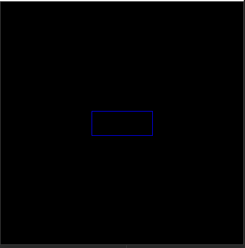
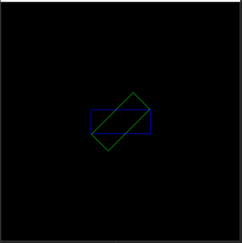
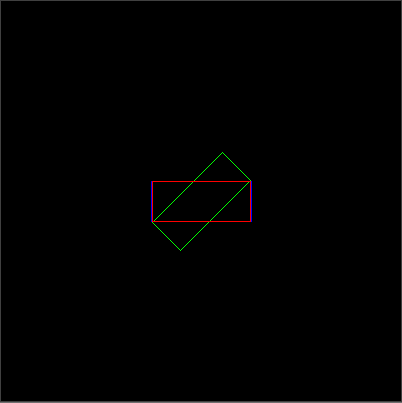

# BboxTransform
Some measures to deal with Bbox.

---

### 目录：

* <a href="#1、BboxRotate">1、BboxRotate</a>


| strategy                                | code                                                         |
| --------------------------------------- | ------------------------------------------------------------ |
| <a href="#1、BboxRotate">BboxRotate</a> | ```rotate = Rotate(test_points, center_point, 0.25)```<br />```new_points = rotate.rotate_bbox()```<br />```new_points = rotate.rotate_again(0.75)``` |
|                                         |                                                              |


---

<p align="right">
    <b><a href="#top">Top</a></b>
	&nbsp;<b>---</b>&nbsp;
	<b><a href="#bottom">Bottom</a></b>
</p>

# 1、BboxRotate

We can initialize a rotating object for a Bbox:（code: BboxTransform/utils/BboxRotate.py）

```python
test_points = [
    [150, 180],
    [150, 220],
    [250, 220],
    [250, 180]
]
center_point = [200, 200]
rotate = Rotate(test_points, center_point, 0.25)
```

**Use the following code to view the original polygon:**

```python
img2 = show(np.array(rotate.points))
```

 


**View rotated graphics:**

```python
new_points = rotate.rotate_bbox()
img2 = show(new_points, (0, 255, 0), img=img2)
```

 

We 've rotated 45 degrees in this step.


**Rotate the Bbox again:**

Rotate the Bbox 135 degrees again

```python
new_points = rotate.rotate_again(0.75)
img2 = show(new_points, (0, 0, 255), img=img2)
```

 

---

<p align="right">
    <b><a href="#top">Top</a></b>
	&nbsp;<b>---</b>&nbsp;
	<b><a href="#bottom">Bottom</a></b>
</p>

<p name="bottom" id="bottom">
    <b>完！</b>
</p>